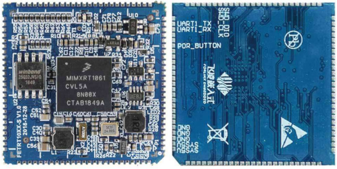
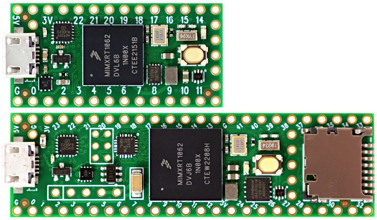

## Support for I.MX RT development boards

### Supported boards

#### [fet1061](fet1061)

Forlinx [FET1061–S](https://www.forlinx.net/product/imx-rt1061-system-on-module-44.html) System On Module: [MIMXRT1061CVL5B](https://www.nxp.com/part/MIMXRT1061CVL5B#/) + 4 MB QSPI NOR Flash [W25Q32JVSIQ](https://www.winbond.com/resource-files/w25q32jv%20spi%20revc%2008302016.pdf)

#### [teensy4](teensy4)

PJRC Teensy 4.x development boards: [Teensy 4.0](https://www.pjrc.com/store/teensy40.html), [Teensy 4.1](https://www.pjrc.com/store/teensy41.html)

### Directory structure

Every supported board has its directory here. Each of them contains three subdirectories:

#### board

The `board` directory contains Go packages that provide the interface to the peripherals available on the board such as buttons, LEDs, etc.
There is also an `init` package that imported configures the whole system for typical usage.
Usually you don't need to import it explicitly because any other package in the `board` directory imports `init` itself to ensure proper operation.

#### doc

The `doc` directory may contain documentation, diagrams, photos and other useful resources.

#### examples

The `examples` directory contains simple programs that demonstrate how to use the available Go packages to work with the board and various external peripherals connected to it.
